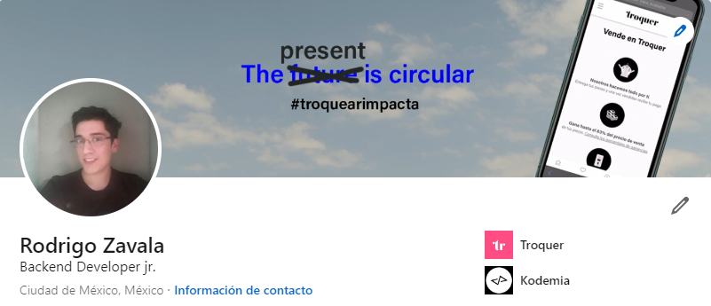
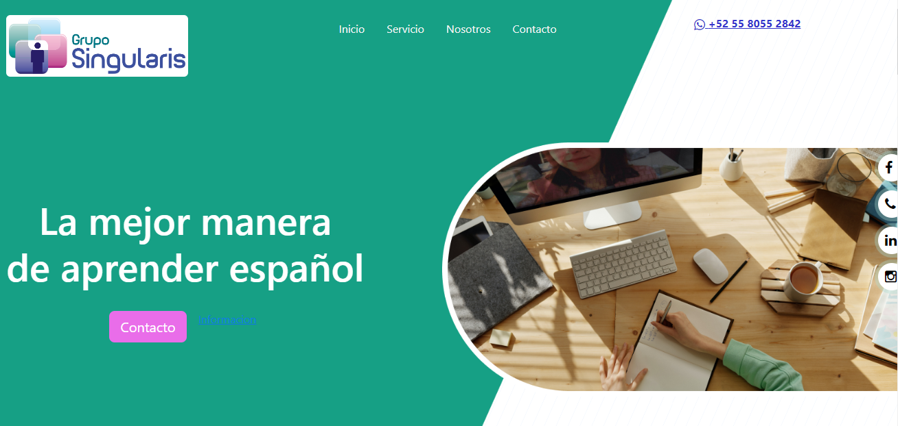

Hello there 👋

I’m Rodrigo from México, a developer jr engineer, creative coder and appasionate for tecnologies topics.

- 🔭 I’m currently working as Developer jr.
- 🌱 I’m currently mastering python -> Django | Flask
- 👯 I’m looking to collaborate on open source projects related to Javacscript and Python languages
- 🤔 I’m looking for help with python projects to improve skills
- ⚡ Fun fact: I love dogs!! 🐶

## 📌 Pinned Repositories
 

 

 

 
 

## &#x1f4c8; GitHub Stats

 

 
 

## 🔨 Recent Projects

 
 

## 💼 Skills

  

<!--

-->
 

## ☕ Recent Activity

